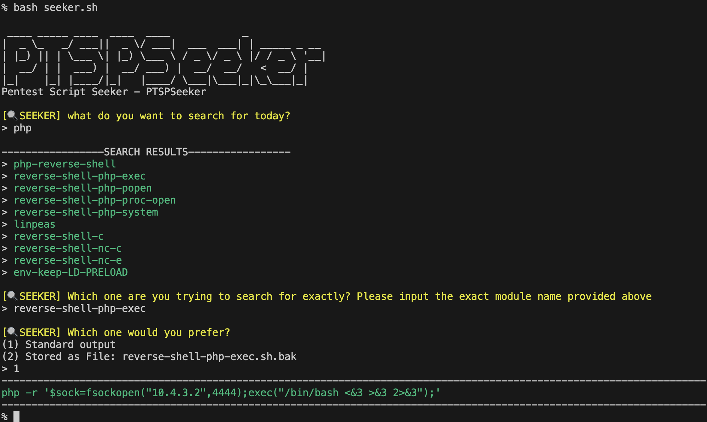
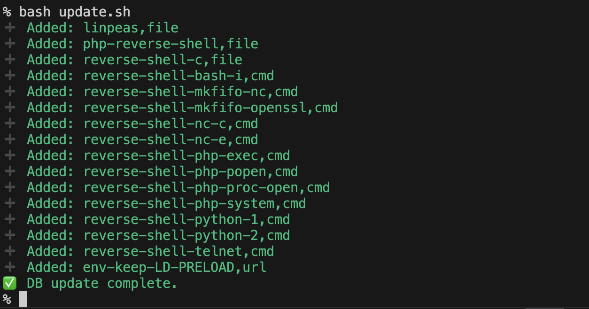

# PTSPseeker
PTSP stands for PenTest ScriPts. It's used for searching a variety of pentest scripts/commands/links. It's outstanded for its simplicity, flexibility, and lightweighted.

## Basic Usage

```bash
# Method 1
chmod +x seeker.sh
./seeker.sh

# Method 2
bash seeker.sh
```

## Update Database
PTSPSeeker accepts users to customize the script and database. If you want to add some new scripts and update the seeker.db file, just run update.sh file after adding files to database folder. Currently I've not completed the functionality of utilizing module type(file,cmd,url). However, this feature will definitely be available in the future.

You can just simply run update.sh and it'll automaticlly detect files under database folder and modifies seeker.db file.

```bash
# Method 1
chmod +x update.sh
./update.sh

# Method 2
bash update.sh
```

## Demo
- Simple Usage

- Update Progress


## Version
|版本|日期|作者|完成功能|
|-------|-------|-------|------------------------------|
|v1.0.0|2025/07/01|Owen| 基本功能、自動更新seeker.db、基本reverse shell|

